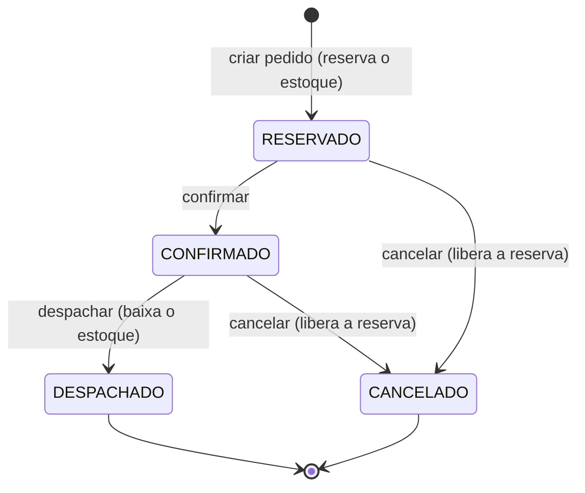

# LH Supplement Distributor — Mini-ERP

Mini-ERP de estoque e pedidos para uma distribuidora **fictícia** de suplementos
(whey, creatina etc.) que vende para varejistas (B2B). Projeto de estudo e portfólio,
focado em **consistência de dados em fluxos de várias etapas**: pedido, reserva de estoque,
despacho e cancelamento, com transações, estados e permissões.

> 🚧 Em construção. Veja o [status](#status) abaixo.

## O problema

Distribuidoras pequenas controlam estoque em planilha: prometem o que não têm, não sabem
o que repor e não sabem quem alterou o quê. Este sistema resolve isso com reserva de estoque
no momento do pedido, movimentações rastreáveis, estados de pedido bem definidos e permissões por perfil.

## O fluxo central



- **Disponível = físico − reservado.** Criar pedido reserva todos os itens de uma vez, tudo ou nada.
- **Despachar** baixa o estoque físico e a reserva juntos, em uma transação.
- **Cancelar** libera a reserva. Pedidos `CANCELADO` e `DESPACHADO` não podem mais ser alterados.
- Cada mudança de estado grava um evento (quem, quando, motivo): a linha do tempo do pedido.

## Funcionalidades (MVP)

- Autenticação e permissões por perfil (RBAC) com regra de dono do pedido
- Produtos, categorias e clientes (varejistas)
- Estoque: entradas, ajustes com motivo, saldo físico, reservado e disponível
- Pedidos: criação com verificação de disponibilidade e reserva, confirmação, despacho e cancelamento
- Histórico (auditoria) de cada pedido
- Relatórios e **dashboard** com KPIs e gráficos, adaptados ao perfil
- Frontend enxuto (5 telas) para demonstrar o fluxo completo

**Fora do escopo (v2):** devolução de pedido despachado, edição de itens, estado "entregue",
limite de crédito, idempotência por chave, nota fiscal, multi-filial, financeiro, pagamento, importação CSV.

## Perfis de acesso (resumo)

| Ação | ADMIN | GERENTE | ESTOQUISTA | VENDEDOR |
|---|---|---|---|---|
| Gerir usuários | ✅ | ❌ | ❌ | ❌ |
| Produtos e entrada de estoque | ✅ | ✅ | ✅ | ❌ (só consulta) |
| Ajustar estoque | ✅ | ✅ | ❌ | ❌ |
| Criar pedido | ✅ | ✅ | ❌ | ✅ |
| Confirmar pedido | ✅ | ✅ | ❌ | ❌ |
| Despachar pedido | ✅ | ✅ | ✅ | ❌ |
| Cancelar pedido | ✅ (RESERVADO ou CONFIRMADO) | ✅ (RESERVADO ou CONFIRMADO) | ❌ | só o próprio, em RESERVADO |
| Ver pedidos | todos | todos | todos | só os próprios |

A matriz completa está nas specs 01 e 02.

## Decisões de design

- **Ledger de movimentações:** o saldo físico é consequência de eventos (`MovimentoEstoque`); os saldos no produto são cache.
- **Reserva na criação do pedido**, tudo ou nada, em uma transação.
- **Estoque nunca negativo**, e `0 ≤ reservado ≤ físico` garantido também por `CHECK` no banco.
- **Mudança de estado condicionada ao estado atual:** dois pedidos de despacho simultâneos só valem um.
- **Snapshot de preço** no item do pedido; total calculado no servidor.
- **Estados finais imutáveis** e **soft delete**; nada é apagado.
- **Dinheiro em `Decimal`**, nunca `float`.
- **Endpoints agregados:** o banco calcula os números do dashboard; o front só desenha.

## Stack

| Camada | Tecnologia |
|---|---|
| Front | React, Vite, TypeScript, Tailwind, shadcn/ui |
| Gráficos | shadcn charts (Recharts) e Apache ECharts em casos pontuais |
| Back | Node, Express, TypeScript, Zod, Prisma 7, bcrypt, jsonwebtoken |
| Banco | PostgreSQL (Docker em dev/teste, Neon em produção) |
| Testes | Vitest, Supertest |
| Deploy | Vercel (web), Render (api), Neon (db) |

## Arquitetura (api)

```
presentation → application → domain ← infra
```

- `domain/`: entidades, regras e interfaces de repositório (sem dependências externas)
- `application/`: casos de uso e erros de negócio
- `infra/`: Prisma e serviços de segurança (implementam as interfaces)
- `presentation/`: Express, middlewares, rotas e validação

## Metodologia

Spec-Driven Development: cada feature começa em `specs/`, seguida de testes (vistos falhar) e só
depois da implementação mínima. O contexto do projeto para agentes de IA fica em `CLAUDE.md` e
o estado atual em `docs/HANDOFF.md`.

## Status

- [x] Fase 1: Fundação (estrutura, CLAUDE.md, README, Docker, ambiente de testes)
- [ ] Fase 2: Autenticação e permissões (domínio, casos de uso e infraestrutura prontos; base da API pronta; faltam middlewares, rotas e seed)
- [ ] Fase 3: Produtos e clientes
- [ ] Fase 4: Estoque (movimentações, reservado e disponível)
- [ ] Fase 5: Pedidos (reserva, estados, despacho, cancelamento, histórico)
- [ ] Fase 6: Relatórios (endpoints agregados)
- [ ] Fase 7: Frontend base (5 telas)
- [ ] Fase 8: Dashboard
- [ ] Fase 9: Seed de dados e deploy

## Como rodar

_Será documentado após a Fase 2._

## Demo

_URL e prints serão adicionados no deploy._