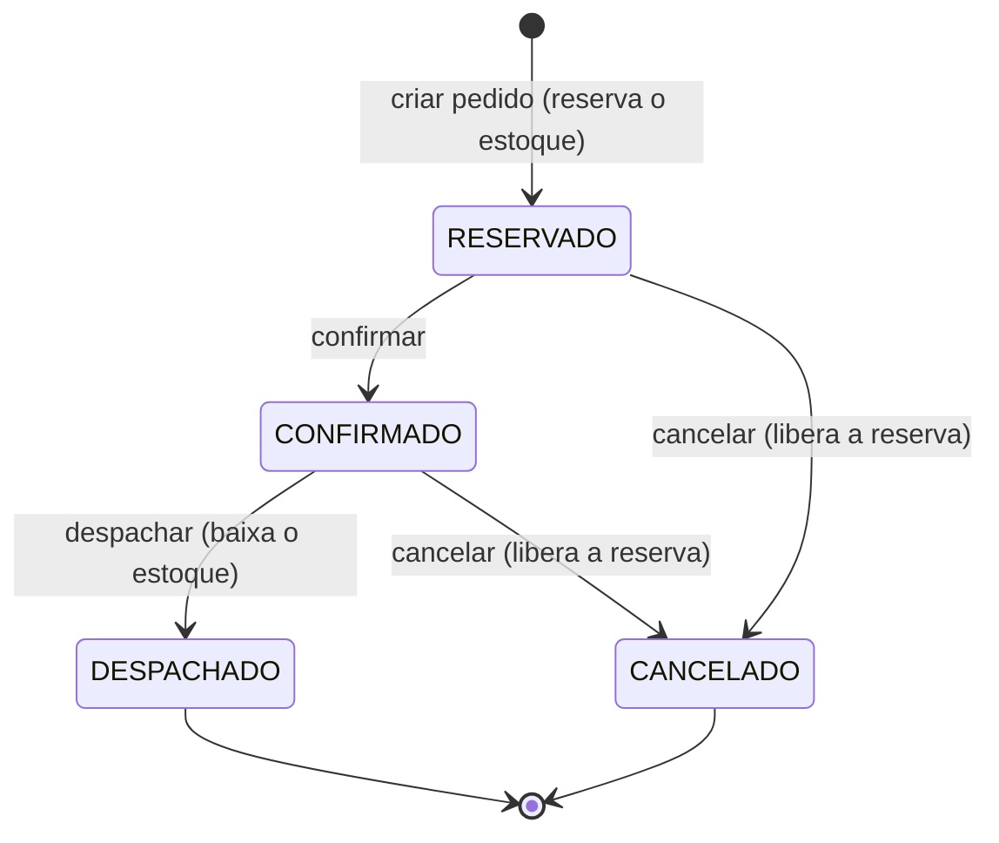

# Spec 02 — Estoque e Pedidos (reserva, estados e cancelamento)

Status: aprovada pelo usuário em 2026-10-10. Implementação nas Fases 4 (Estoque) e 5 (Pedidos).

## 1. Objetivo
Demonstrar um fluxo de várias etapas que mantém os dados consistentes: criar pedido, verificar disponibilidade, reservar estoque, confirmar, despachar e cancelar, com transações, estados e permissões claras.

## 2. Conceitos de estoque
| Conceito | Definição |
|---|---|
| saldoFisico | Unidades no depósito. Igual à soma dos `delta` dos movimentos do produto |
| saldoReservado | Unidades prometidas a pedidos RESERVADO ou CONFIRMADO |
| disponivel | saldoFisico - saldoReservado: o que ainda pode ser prometido |

Invariantes (valem sempre):
- I1: saldoFisico = soma dos delta em MovimentoEstoque do produto.
- I2: saldoReservado = soma das quantidades dos itens de pedidos RESERVADO e CONFIRMADO.
- I3: 0 <= saldoReservado <= saldoFisico (também imposto por CHECK no banco).

## 3. Estados do pedido

| De | Para | Ação | Efeito no estoque | Quem pode |
|---|---|---|---|---|
| (novo) | RESERVADO | Criar | saldoReservado + quantidade de cada item | pedidos:criar |
| RESERVADO | CONFIRMADO | Confirmar | nenhum (a reserva continua) | pedidos:confirmar |
| CONFIRMADO | DESPACHADO | Despachar | movimento SAIDA por item; saldoFisico e saldoReservado diminuem juntos | pedidos:despachar |
| RESERVADO | CANCELADO | Cancelar | saldoReservado diminui (libera) | pedidos:cancelar, ou pedidos:cancelar_proprio se for o criador |
| CONFIRMADO | CANCELADO | Cancelar | saldoReservado diminui (libera) | pedidos:cancelar |

Qualquer outra transição responde 409 TRANSICAO_INVALIDA.

## 4. Regras de negócio
- RP01: o pedido nasce RESERVADO e reserva todos os itens na mesma transação, tudo ou nada. Se faltar estoque em qualquer item, nada é criado e a resposta lista os itens com falta (código ESTOQUE_INSUFICIENTE).
- RP02: validações da criação: cliente ativo; de 1 a 50 itens; produto repetido não é permitido; quantidade inteira maior que zero; todos os produtos ativos.
- RP03: preço unitário congelado no momento da criação; subtotal e total são calculados no servidor.
- RP04: apenas as transições da seção 3 são permitidas.
- RP05: confirmar não altera o estoque.
- RP06: despachar executa em uma transação: SAIDA por item, baixa de físico e reservado, mudança de estado. A mudança de estado é condicionada ao estado atual, então despachar duas vezes só vale uma.
- RP07: cancelar exige motivo (mínimo 5 caracteres) e libera as reservas dos itens. O vendedor só cancela o próprio pedido e apenas em RESERVADO; ADMIN e GERENTE cancelam pedidos RESERVADO ou CONFIRMADO.
- RP08: CANCELADO e DESPACHADO são finais e imutáveis. Os itens de um pedido nunca são editados após a criação.
- RP09: qualquer falha em qualquer etapa desfaz tudo. Nunca existem reserva sem pedido, pedido sem reserva ou saída sem baixa.
- RP10: toda mudança de estado grava um PedidoEvento (quem, quando, de, para, motivo).
- RP11: o vendedor lista e consulta somente pedidos que criou; ADMIN, GERENTE e ESTOQUISTA consultam todos.
- RP12: produto com saldoReservado maior que zero não pode ser desativado; ajuste negativo de estoque não pode deixar saldoFisico abaixo de saldoReservado.
- RP13: concorrência: dois pedidos disputando a última unidade, só um reserva; despachar e cancelar simultâneos, só um vence.
- RP14 (Plus): reserva expira. Pedido RESERVADO há mais de 24 h pode ser cancelado em lote por pedidos:expirar_reservas, com motivo "reserva expirada".

## 5. Permissões (substituem vendas:* e relatorios:proprias_vendas da spec 01)
| Permissão | ADMIN | GERENTE | ESTOQUISTA | VENDEDOR |
|---|---|---|---|---|
| produtos:ler | ✅ | ✅ | ✅ | ✅ |
| produtos:escrever | ✅ | ✅ | ✅ | ❌ |
| clientes:ler | ✅ | ✅ | ❌ | ✅ |
| clientes:escrever | ✅ | ✅ | ❌ | ❌ |
| estoque:entrada | ✅ | ✅ | ✅ | ❌ |
| estoque:ajustar | ✅ | ✅ | ❌ | ❌ |
| pedidos:criar | ✅ | ✅ | ❌ | ✅ |
| pedidos:ler_todos | ✅ | ✅ | ✅ | ❌ |
| pedidos:ler_proprios | ❌ | ❌ | ❌ | ✅ |
| pedidos:confirmar | ✅ | ✅ | ❌ | ❌ |
| pedidos:despachar | ✅ | ✅ | ✅ | ❌ |
| pedidos:cancelar | ✅ | ✅ | ❌ | ❌ |
| pedidos:cancelar_proprio | ❌ | ❌ | ❌ | ✅ |
| pedidos:expirar_reservas | ✅ | ❌ | ❌ | ❌ |

Observação: permissões dizem "o que o perfil pode"; as regras RP07 e RP11 acrescentam "sobre quais recursos" (dono do pedido e estado atual), verificadas no caso de uso.

## 6. Modelo de dados (resumo)
| Tabela | Campos principais |
|---|---|
| Categoria | id, nome |
| Produto | id, sku (único), nome, categoriaId, precoVenda, custo, estoqueMinimo, saldoFisico, saldoReservado, ativo. CHECK: saldoFisico >= 0, saldoReservado >= 0, saldoReservado <= saldoFisico |
| MovimentoEstoque | id, produtoId, tipo (ENTRADA, SAIDA, AJUSTE), delta (positivo entra, negativo sai), motivo, pedidoId?, usuarioId, criadoEm |
| Cliente | id, razaoSocial, cnpj (único, 14 dígitos), ativo |
| Pedido | id, numero (sequencial), clienteId, criadoPorId, status, total, canceladoMotivo?, expiraEm?, criadoEm, atualizadoEm |
| ItemPedido | id, pedidoId, produtoId, quantidade, precoUnitario (snapshot) |
| PedidoEvento | id, pedidoId, deStatus?, paraStatus, usuarioId, motivo?, criadoEm |

Dinheiro em Decimal. Nunca excluir pedidos nem movimentos.

## 7. API (resumo)
| Rota | Permissão | Resultado |
|---|---|---|
| GET /produtos | produtos:ler | lista com saldoFisico, saldoReservado e disponivel |
| POST /estoque/entradas | estoque:entrada | movimento ENTRADA |
| POST /estoque/ajustes | estoque:ajustar | movimento AJUSTE (motivo obrigatório) |
| GET, POST /clientes | clientes:ler, clientes:escrever | clientes |
| POST /pedidos | pedidos:criar | 201 pedido RESERVADO; 409 ESTOQUE_INSUFICIENTE com itens |
| GET /pedidos, GET /pedidos/:id | ler_todos ou ler_proprios | lista e detalhe com itens e eventos |
| POST /pedidos/:id/confirmar | pedidos:confirmar | RESERVADO para CONFIRMADO |
| POST /pedidos/:id/despachar | pedidos:despachar | CONFIRMADO para DESPACHADO |
| POST /pedidos/:id/cancelar | cancelar ou cancelar_proprio | CANCELADO, corpo `{ motivo }` |
| POST /pedidos/expirar-reservas (Plus) | pedidos:expirar_reservas | cancela reservas vencidas |

Novos códigos de erro: ESTOQUE_INSUFICIENTE (409), TRANSICAO_INVALIDA (409), PEDIDO_NAO_ENCONTRADO (404), PRODUTO_COM_RESERVAS (409), CLIENTE_INATIVO (422), PRODUTO_INATIVO (422), SEM_PERMISSAO (403).

## 8. Cenários de teste (harness)
| Grupo | Nível | O que prova |
|---|---|---|
| P01 a P03 | unitário | máquina de estados: transições válidas, inválidas e estados finais imutáveis |
| P10 a P15 | unitário | criar pedido: reserva todos os itens; falta de estoque em um item não cria nada e lista a falta; produto inativo, cliente inativo e item repetido são recusados; preço congelado e total correto |
| P16 a P19 | unitário | confirmar não mexe no estoque; despachar gera SAIDA e baixa físico e reservado; despachar duas vezes falha; cancelar libera a reserva e exige motivo |
| P20 a P23 | unitário | vendedor cancela o próprio RESERVADO; não cancela pedido alheio nem CONFIRMADO; cancelado não pode ser confirmado, despachado nem cancelado de novo |
| P24 | unitário | todo estado gera PedidoEvento |
| P30 | integração | atomicidade: falha no segundo item desfaz a reserva do primeiro |
| P31 | integração | concorrência: dois pedidos disputando a última unidade, só um vence |
| P32 | integração | despachar e cancelar simultâneos, só um vence |
| P33 | integração | invariantes I1, I2 e I3 valem após uma sequência de operações |
| P34 | integração | CHECK do banco recusa saldo reservado maior que o físico |
| P40 | HTTP | fluxo completo: vendedor cria, gerente confirma, estoquista despacha, saldos corretos |
| P41 | HTTP | matriz de permissões por endpoint (403 quando não pode) |

## 9. Frontend enxuto (5 telas)
1. Login.
2. Produtos: físico, reservado e disponível; formulário de entrada de estoque (perfis com permissão).
3. Novo pedido: escolher cliente, adicionar itens vendo a disponibilidade, enviar; falta de estoque mostra os itens com falta.
4. Pedidos: lista com filtro por estado.
5. Detalhe do pedido: linha do tempo de eventos e botões Confirmar, Despachar e Cancelar (com motivo), exibidos conforme perfil e estado.

O dashboard (Fase 8) mantém o recorte e usa os mesmos dados: faturamento passa a significar pedidos DESPACHADOS no período.

## 10. Fora do escopo (v2)
Devolução de pedido despachado (movimento de estorno), edição de itens, estado ENTREGUE, limite de crédito, idempotência por chave, reservas parciais ou backorder, pagamentos.